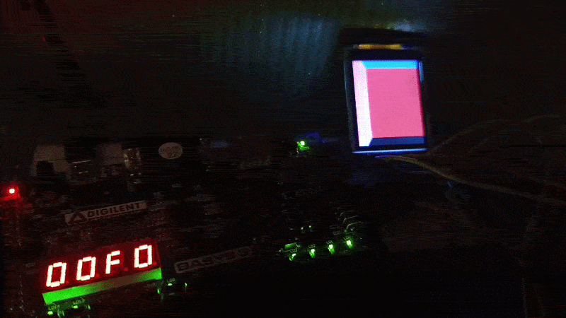
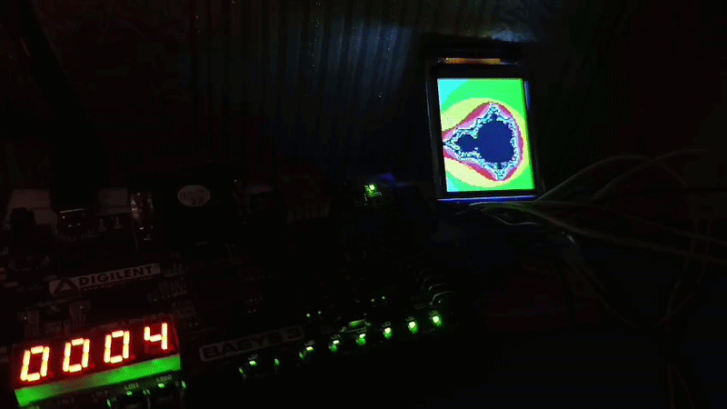
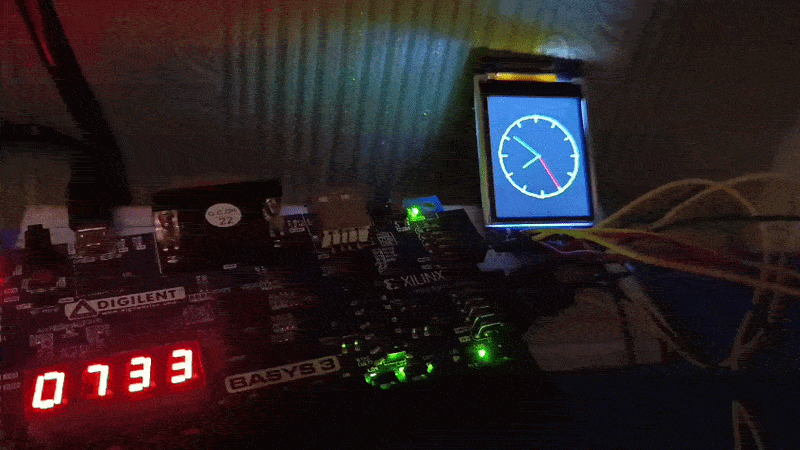
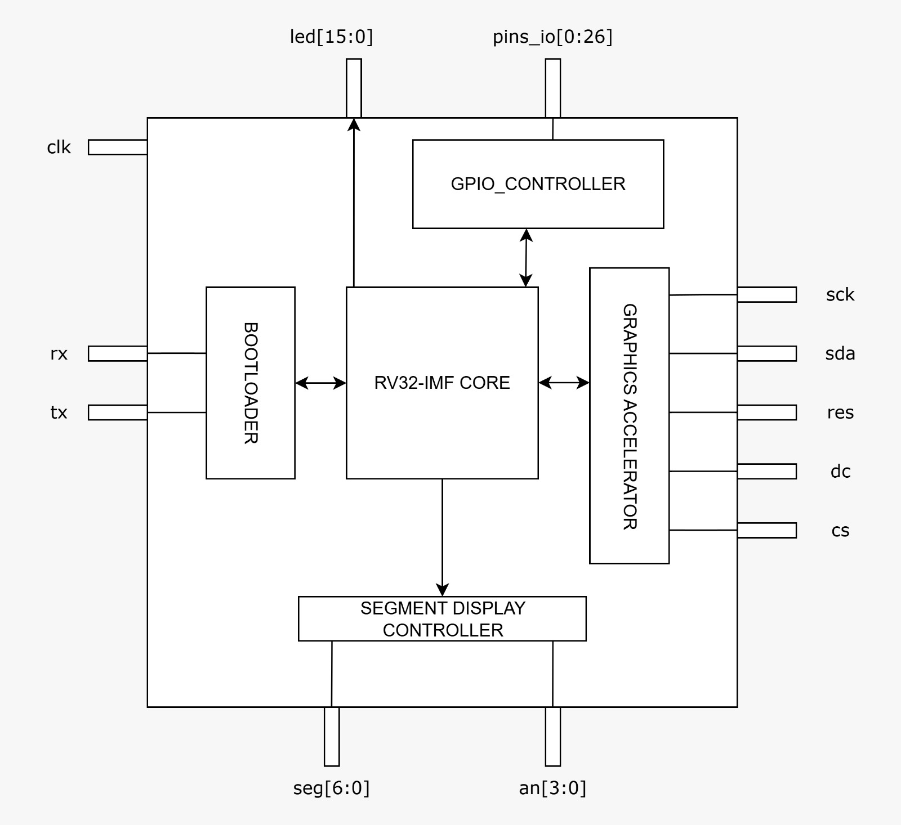

# RISC-V FPGA System-on-Chip

A custom bare-metal System-on-Chip built from the ground up in Verilog/SystemVerilog and deployed on an FPGA. The design integrates a custom RV32-IMF CPU core, a hardware-accelerated graphics pipeline, a UART bootloader, and a suite of board-level peripherals, all validated by a library of bare-metal test programs.

---

## Table of Contents

- [Visual Showcase](#visual-showcase)
- [System Architecture](#system-architecture)
  - [RV32-IMF CPU Core](#rv32-imf-cpu-core)
  - [Graphics Accelerator](#graphics-accelerator)
  - [Peripherals](#peripherals)
- [Hardware Specifications](#hardware-specifications)
    - [Synthesis & Memory Inference](#synthesis--memory-inference)
- [Automated Build & Deployment Pipeline](#automated-build--deployment-pipeline)
- [Bare-Metal Software Suite](#bare-metal-software-suite)
- [Bare-Metal Library](#bare-metal-library)
- [Build & Flash Quickstart](#build--flash-quickstart)
- [Credits & License](#credits--license)

---

## Visual Showcase

| Demo | Description | Preview |
|---|---|---|
| **Raycasting Engine** | Real-time raycasted 3D rendering executed entirely on the custom CPU core. |  |
| **Mandelbrot Explorer** | Fixed/floating-point fractal generation exercising the hardware FPU. |  |
| **Real-Time Clock** | Live clock application driving the seven-segment and LCD peripherals. |  |

---

## System Architecture



*Figure 1: Top-level block diagram of the SoC.*

### RV32-IMF CPU Core

The heart of the SoC is a custom 32-bit RISC-V CPU implementing the **RV32-IMF** instruction set:

- **Base ISA (I):** Full 32-bit integer instruction set.
- **Multiplication/Division extension (M):** Hardware multiplier and divider, removing the need for software emulation of integer math.
- **Single-Precision Floating-Point extension (F):** Dedicated hardware FPU for IEEE 754 single-precision arithmetic, used extensively by the graphics and simulation test suite.

**Branch Prediction Unit**

The core includes a dynamic branch prediction unit built around a **Gshare predictor** paired with a **Branch Target Buffer (BTB)**, along with full misprediction recovery so the pipeline can flush and redirect fetch cleanly whenever a prediction is wrong.

**Cache Subsystem**

The memory subsystem follows a **Harvard architecture**, with physically separate **Instruction Cache (ICache)** and **Data Cache (DCache)** paths. This separation allows simultaneous instruction fetch and data access without structural hazards, improving sustained throughput for both compute-bound and graphics-bound workloads.

**Memory Map / Stack Layout**

Program static data (code, read-only data, and initialized/uninitialized globals) is laid out starting at address `0x00000000` and grows **upward** through memory. The upper region of the address space is reserved for the **call stack**, which grows downward toward the static data region. This layout is enforced automatically by the linker scripts generated by the build toolchain (see [Automated Build & Deployment Pipeline](#automated-build--deployment-pipeline)).

### Graphics Accelerator

The SoC includes a dedicated hardware **Graphics Accelerator** that takes high-level drawing commands from software, rasterizes them, and drives the display, all without CPU-side pixel pushing.

The standout feature is its **modular display interface**: the accelerator's output stage is fully decoupled from its rasterization core, so it doesn't lock you into one screen. Developers can write and attach their own display controller to drive whatever hardware they're targeting.

**Current Display Driver:** Ships with an integrated **ST7735 LCD controller** out of the box, with the modular interface ready for you to swap in your own.

### Peripherals

**UART Bootloader**

Programs are loaded onto the SoC over a UART link rather than requiring FPGA re-synthesis for every iteration. A host-side Python deployment script communicates with the on-chip bootloader to stream compiled program images directly into SoC memory, enabling a fast edit-compile-flash-run development loop.

**Seven-Segment Display Controller**

A board-level peripheral controller for driving multi-digit seven-segment displays. An `ACTIVE_LOW` macro is provided to configure the controller's output polarity, allowing the same RTL to target both active-high and active-low segment hardware across different board revisions without modification.

**GPIO Controller**

A dedicated general-purpose I/O controller exposing configurable pin state (direction, read, and write) to software, used by diagnostic and peripheral-driver test programs.

---

## Hardware Specifications

| Category | Specification |
|---|---|
| **ISA** | RV32-IMF (Base Integer + Multiply/Divide + Single-Precision Float) |
| **Pipeline Front-End** | Gshare dynamic branch predictor + Branch Target Buffer (BTB) with full misprediction recovery |
| **Memory Topology** | Harvard architecture — split Instruction Cache (ICache) and Data Cache (DCache) |
| **Memory Layout** | Static data from `0x00000000` growing upward; stack occupies upper memory, growing downward |
| **Graphics Accelerator Pipeline** | Instruction buffer → hardware rasterizer → span FIFO → modular display interface |
| **Display Driver** | ST7735 LCD controller (integrated) |
| **Bootloader Interface** | UART, host-controlled via Python deployment script |
| **Auxiliary Peripherals** | Seven-segment display controller (`ACTIVE_LOW` configurable), GPIO controller |
| **HDL Languages** | Verilog / SystemVerilog |
| **Target Platform** | FPGA (bare-metal, no OS) |

### Synthesis & Memory Inference

The RTL includes multi-vendor synthesis directives to automatically infer dedicated **Block RAM (BRAM)** instead of distributed logic resources across major FPGA toolchains:

```verilog
`ifdef VIVADO
    (* ram_style = "block" *)
`elsif QUARTUS
    (* ramstyle = "block" *)
`endif
```
---

## Automated Build & Deployment Pipeline

The `run.sh` (Linux/macOS) and `run.bat` (Windows) scripts provide an end-to-end, single-command build and deployment flow, with identical dependencies and behavior on both platforms:

1. **Cross-Compilation** — Compiles multi-translation-unit C source files for the `rv32imf` target architecture using `riscv64-unknown-elf-gcc`.
2. **Dynamic Linker Script Generation** — Generates a linker script tailored to each build, separating instruction memory (`.text`) from data memory (`.rodata`, `.data`, `.sdata`, `.bss`), consistent with the SoC's memory map.
3. **Binary Conversion** — Converts the linked ELF output into raw hex images suitable for loading into SoC memory.
4. **UART Deployment** — Invokes an inline Python serial client (using `pyserial`) that streams the resulting hex image to the board over the UART bootloader link, without requiring FPGA re-synthesis.

This pipeline allows firmware iteration to happen entirely in software, with hardware programming reserved for actual RTL changes.

---

## Bare-Metal Software Suite

The `program_tests/` directory contains a multi-program test suite validating the CPU, FPU, GPU, and peripheral drivers.

---

## Bare-Metal Library

The [`libc-baremetal/`](libc-baremetal/) directory provides a lightweight, dependency-free library for writing bare-metal programs against the SoC:

| Header | Purpose |
|---|---|
| `graphics.h` | GPU command wrappers for issuing drawing calls (triangles, shapes, and other draw commands) to the graphics pipeline |
| `system.h` |System timing functions calibrated for the core CPU clock speed |
| `led.h` | Driver interface for the seven-segment and external LED peripherals |
| `pin.h` | GPIO pin configuration and read/write access |

Every program in [`program_tests/`](#bare-metal-software-suite) is built against this library, so it's the first place to look when writing a new bare-metal application.

---

## Build & Flash Quickstart

**Linux / macOS**

```bash
# Clone the repository
git clone https://github.com/f3rhd/rv_soc.git
cd rv_soc

# Make the build script executable (first run only)
chmod +x run.sh

# Build and flash a specific test program to the board
./run.sh program_tests/raycasting.c libc-baremetal/src/graphics.c libc-baremetal/src/led.c Os

# Example: build and flash the Mandelbrot demo
./run.sh program_tests/mandelbrot_free.c libc-baremetal/src/graphics.c libc-baremetal/src/led.c Os

# Example: build and flash the real-time clock application
./run.sh program_tests/clock.c libc-baremetal/src/graphics.c libc-baremetal/src/led.c Os
```

**Windows**

```bat
:: Clone the repository
git clone https://github.com/f3rhd/rv_soc.git
cd rv_soc

:: Build and flash a specific test program to the board
run.bat programs\raycasting.c libc-baremetal\src\graphics.c libc-baremetal\src\led.c Os

:: Example: build and flash the Mandelbrot demo
run.bat programs\mandelbrot_free.c libc-baremetal\src\graphics.c libc-baremetal\src\led.c Os

:: Example: build and flash the real-time clock application
run.bat programs\clock.c libc-baremetal\src\graphics.c libc-baremetal\src\led.c Os
```

**Prerequisites**

- `riscv64-unknown-elf-gcc` toolchain installed and available on `PATH` (same requirement on Windows and Linux/macOS)
- Python 3 with the [`pyserial`](https://pypi.org/project/pyserial/) package installed (`pip install pyserial`) — required by the UART deployment client on both platforms
- FPGA board flashed with the current SoC bitstream and connected via UART/USB

---

## Credits & License

**Author:** `f3rhd`

**License:**  See the [`LICENSE`](LICENSE) file for details.
